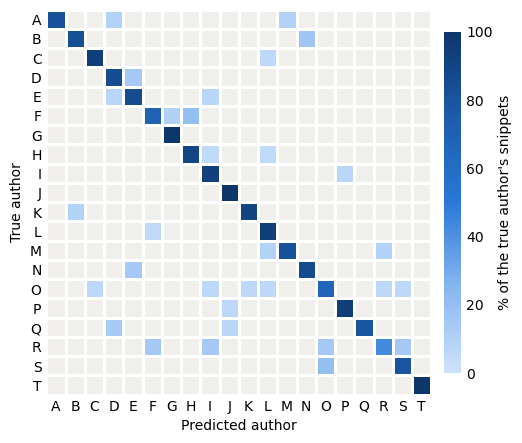

# Assignment 3 — Authorship attribution

Predict the author of each fanfiction snippet among 20 authors. 

  

## Ownership and handoffs

| Owner | Delivers |
|---|---|
| Member 1 | Data loader, feature extractor, feature names and groups |
| Miquel | Classifier class, reusable training function, chosen settings, model and predictions |
| Member 3 | Evaluation functions, ablation results, figures and error analysis |

## Design Decisions

- Description of each type of features
- Effect of each group

## Classifier evaluation

For the classifier, we used a Linear Support Vector Classification ([Linear SVC](https://scikit-learn.org/stable/modules/generated/sklearn.svm.LinearSVC.html)) from Scikit learn.

To improve performance, we also used a [Standard Scaler](https://scikit-learn.org/stable/modules/generated/sklearn.preprocessing.StandardScaler.html) to standardize features. This step is crucial before training the SVC, because due to its nature, the SVC is not scale invariant. For that, the scaler transforms each attribute to a scale from -1 to 1.

### Would it be useful in your particular case to use feature selection

We don't think it would be, since for this particular case we are creating our own features. This makes it so that we can create only the features we want to use for the Classifier.

If this was part of a larger project, where the data was already given to us with many other features, then it would be interesting to perform some feature selection.

## Analysis of the results

Before implementing the pipeline with the Standard Scaler, we got the F-Score for the dev dataset to around 0.65.

With the addition of the scaler, the F-score jumped to 0.85. This jump in performance is quite noticeable, for such a simple change, and there is still a lot of room for improvement by adding more steps to the pipeline.

However, due to time limitations and wanting to keep the focus of this program on the feature extraction, we decided to keep this simple pipeline.

## Problems we encountered

Do failure analysis

## What problems could we solve with an extra 10 hours?

We could probably get the F-score to 0.9 or more by adding more steps to the model used by the Classifier, and maybe try other models, such as Neural Networks.

## What problems do we think are real challenges in authorship attribution?
